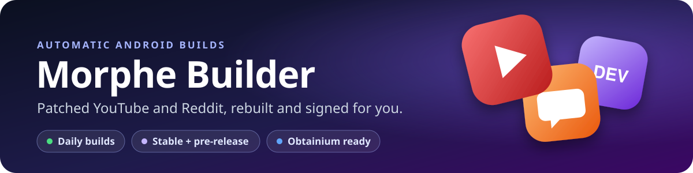

<div align="center">



**Patched Android apps, built with [Morphe](https://morphe.software) patches and published here automatically.**<br>
Download an APK, or add it to Obtainium once and get every update on your phone.

[](https://github.com/Qutaiba-Khader/morphe-builder/actions/workflows/ci.yml)
[](https://github.com/Qutaiba-Khader/morphe-builder/releases)
[](https://github.com/Qutaiba-Khader/morphe-builder/releases)
[](LICENSE)

**[Download](#download)** · **[Install](#install)** · **[Stable or pre-release?](#stable-or-pre-release)** · **[Website](https://qutaiba-khader.github.io/morphe-builder/)** · **[How it works](#how-it-works)**

</div>

## Download

<!-- apps:start — generated by tools/gen_readme.py, edits here are overwritten -->
### Stable

The everyday builds. Start here.

| App | Download or auto-update |
|---|---|
| **Reddit**<br>`2026.14.0`<br><sub>2026-09-21</sub> | [](https://github.com/Qutaiba-Khader/morphe-builder/releases/download/26.09.21-morphe/reddit-morphe-v2026.14.0-all.apk) [][obt-reddit] |
| **YouTube**<br>`21.16.256`<br><sub>2026-09-21</sub> | [](https://github.com/Qutaiba-Khader/morphe-builder/releases/download/26.09.21-morphe/youtube-morphe-v21.16.256-all.apk) [][obt-youtube] |

### Pre-release

Newer app versions with development patches. Each one installs **next to** its stable app, under its own name.

| App | Download or auto-update |
|---|---|
| **Reddit Experimental**<br>`2026.38.0`<br><sub>2026-09-21</sub> | [](https://github.com/Qutaiba-Khader/morphe-builder/releases/download/26.09.21-morphe-dev/reddit-experimental-morphe-dev-v2026.38.0-all.apk) [][obt-reddit-experimental] |
| **YouTube Experimental**<br>`21.38.123`<br><sub>2026-09-21</sub> | [](https://github.com/Qutaiba-Khader/morphe-builder/releases/download/26.09.21-morphe-dev/youtube-experimental-morphe-dev-v21.38.123-all.apk) [][obt-youtube-experimental] |

[][obt:all] [](https://qutaiba-khader.github.io/morphe-builder/)

<details>
<summary><b>Package names, releases and Obtainium endpoints</b></summary>

| App | Channel | Package | Release | Obtainium endpoint |
|---|---|---|---|---|
| Reddit | stable | `com.reddit.frontpage` | [`26.09.21-morphe`](https://github.com/Qutaiba-Khader/morphe-builder/releases/tag/26.09.21-morphe) | [reddit.html](https://qutaiba-khader.github.io/morphe-builder/obtainium/reddit.html) |
| Reddit Experimental | pre-release | `com.reddit.frontpage.morphe` | [`26.09.21-morphe-dev`](https://github.com/Qutaiba-Khader/morphe-builder/releases/tag/26.09.21-morphe-dev) | [reddit-experimental.html](https://qutaiba-khader.github.io/morphe-builder/obtainium/reddit-experimental.html) |
| YouTube | stable | `app.morphe.android.youtube` | [`26.09.21-morphe`](https://github.com/Qutaiba-Khader/morphe-builder/releases/tag/26.09.21-morphe) | [youtube.html](https://qutaiba-khader.github.io/morphe-builder/obtainium/youtube.html) |
| YouTube Experimental | pre-release | `app.morphe.android.youtube.dev` | [`26.09.21-morphe-dev`](https://github.com/Qutaiba-Khader/morphe-builder/releases/tag/26.09.21-morphe-dev) | [youtube-experimental.html](https://qutaiba-khader.github.io/morphe-builder/obtainium/youtube-experimental.html) |

Every earlier build: the **All versions** button on the [website](https://qutaiba-khader.github.io/morphe-builder/), or `api/apps/<app>.json`.

Patch catalog: 9 sources able to patch 360 apps, in the website's **Catalog** tab or [`data/catalog.json`](data/catalog.json).

</details>
<!-- apps:end -->

## Install

1. **On your phone**, tap **Download** next to the app you want, then open the APK. If Android asks, allow your browser to install apps.
2. **YouTube only:** install [MicroG-RE](https://github.com/MorpheApp/MicroG-RE/releases/latest) once. It is what lets YouTube sign in to your Google account.
3. **To get updates by themselves**, tap **Add to Obtainium** instead of Download. [Obtainium](https://github.com/ImranR98/Obtainium) installs the app and tells you whenever a new build is out.

> [!IMPORTANT]
> Stable **Reddit** keeps Reddit's own package name, so it cannot install over Reddit from the Play Store. Uninstall that one first. YouTube and every pre-release build are renamed, so they install next to what you already have.

> [!NOTE]
> The APKs are signed with this repository's own key. A new build installs over an older one from here, but not over a build from another patcher.

## Stable or pre-release?

**Pick stable** unless you want to try new things early. You can also have both.

| | Stable | Pre-release |
|---|---|---|
| **Best for** | everyday use | trying new features early |
| **Patches** | the latest release | the newest development build |
| **App version** | the newest one the patches support | usually much newer |
| **On your phone** | the main app | a second app next to it: *YouTube Morphe Dev*, *Reddit Morphe Dev* |

> [!WARNING]
> Pre-release builds get their own package from the `Clone app` patch, which its authors say "does not work with all apps and may cause app crashes". If a pre-release build misbehaves, suspect that first.

<br>

---

## How it works

You don't need any of this to install the apps. It is here for the curious and for anyone running their own copy.

### It updates itself

| Workflow | When | What it does |
|---|---|---|
| **CI** | daily at **10:00 UTC**, or on demand | For each brand in [`config.toml`](config.toml), compares the patch source's newest release with ours. If the patches moved, it downloads the stock APK, patches it, signs it and publishes a release tagged `YY.MM.DD-<brand>`. If nothing moved, no release. |
| **Site** | after every build, every 6 hours, and on push | Rebuilds the [website](https://qutaiba-khader.github.io/morphe-builder/), the JSON API and the Download tables above from the releases, and publishes them to the `gh-pages` branch. While a build is still running it leaves the live site alone and runs again when the build finishes. |
| **Catalog** | weekly, **Monday 04:00 UTC**, or on demand | Rebuilds [`data/catalog.json`](data/catalog.json), the list of every app each patch source can patch. |
| **Sync upstream** | daily at **08:00 UTC** | Pulls fixes from [nvbangg/builder-for-morphe](https://github.com/nvbangg/builder-for-morphe) while keeping this fork's own files (the repository variable `IGNORE_SYNC_FILES`). |

A new release appears only when the **patches** move. The check watches the patch source, not APKMirror: Morphe patches declare which app versions they support, and the builder patches the newest supported one, so a new app version becomes usable only once the patches support it.

<details>
<summary><b>Adding an app under a brand that already has releases</b></summary>
<br>

The daily check compares per **brand**, not per app. Every app patched with `MorpheApp/morphe-patches` shares the brand `morphe`, so a newly enabled app under it does not look new. Build it once by hand: **Actions → CI → Run workflow**, tick **Build all apps**. An app under a brand this repository has never built before is picked up by the next daily run.

</details>

### Which patches are applied

Each app gets its patch bundle's **recommended** set, the patches the authors switch on by default, minus the universal ones. For YouTube that means no ads, background play, SponsorBlock, Return YouTube Dislike and more; for Reddit, no ads among others. The website's **Catalog** tab shows how many of each app's patches are recommended, and [`data/catalog.json`](data/catalog.json) marks every patch `"default": true` or `false`.

| Left out | Why |
|---|---|
| `Change installer source`, `Clone app`, `Override certificate pinning`, `Disable Play Store updates` | universal patches, excluded in [`config.toml`](config.toml) |
| anything the bundle switches off by default, such as YouTube's `Network proxy` | not part of the recommended set |

<details>
<summary><b>Technical notes on the patch set</b></summary>
<br>

- `GmsCore support` is added by the builder. It is what makes a non-root YouTube work (with MicroG-RE), and it is also what renames the app to `app.morphe.android.youtube`.
- The pre-release builds keep `Clone app` on purpose, because it gives them their own package. For YouTube the package has to be passed to it explicitly (`-e 'Clone app' -OpackageName=…`): `GmsCore support` asks `Clone app` for the package and falls back to `app.morphe.android.youtube` only while that option is still `Default`. A Morphe CLI `-O` option belongs to the `-e` right before it.
- `Disable Play Store updates` needs an explicit exclude because the builder force-enables it. The CLI resolves `-d` over a later `-e`, and the build log confirms it with `Skipping disabled: Disable Play Store updates`. Without it the Play Store is no longer blocked from updating a patched app; that is harmless for YouTube, which is renamed, but worth knowing for an app that keeps its original package.

</details>

### Obtainium

[Obtainium](https://github.com/ImranR98/Obtainium) installs and updates Android apps straight from where they are published. Tap an **Add to Obtainium** button **on your phone** and Obtainium opens with the app filled in; it shows you the settings and waits for you to confirm. **Add every app to Obtainium** adds them all in one go. The same buttons are on the [website](https://qutaiba-khader.github.io/morphe-builder/).

To add an app by hand: **Add App** → URL `https://qutaiba-khader.github.io/morphe-builder/obtainium/youtube.html` → source **HTML**. Every app's endpoint and ready-made settings are in the folded table under Download and in [`api/obtainium.json`](https://qutaiba-khader.github.io/morphe-builder/api/obtainium.json).

> [!NOTE]
> Obtainium follows the **app** version. A rebuild with newer patches but the same app version is not offered as an update. You get it with the next app version, or by installing it again from the website or [Releases](https://github.com/Qutaiba-Khader/morphe-builder/releases).

<details>
<summary><b>Why the Obtainium links point at this website, not at GitHub</b></summary>
<br>

Obtainium's **GitHub** source takes the version from the release **tag**, which here is a date like `26.09.21-morphe`, so it would announce an update on every release even when that app had not changed. Each app's HTML endpoint holds exactly one APK link, and the version is read from the file name (`youtube-morphe-v21.16.256-all.apk` → `21.16.256`), so an update prompt means the app really moved. Apps built for several architectures also get `obtainium/<id>-<arch>.html`.

**Add every app** is served from this website because Obtainium's redirect service only forwards single apps. Everything here is regenerated after every build, so it always points at the newest APK.

</details>

<a id="json-api"></a>
### JSON API

Static files on the website. No key, no rate limit, and `access-control-allow-origin: *`, so a browser or a script can read them directly.

Base URL: `https://qutaiba-khader.github.io/morphe-builder/`

| Endpoint | Returns |
|---|---|
| [`api/index.json`](https://qutaiba-khader.github.io/morphe-builder/api/index.json) | every app, its newest version, when it was built and where its history lives |
| [`api/latest.json`](https://qutaiba-khader.github.io/morphe-builder/api/latest.json) | the newest build of each app in full: version, tag, size, sha256, download URL |
| [`api/apps/<id>.json`](https://qutaiba-khader.github.io/morphe-builder/api/apps/youtube.json) | one app's complete build history |
| [`api/catalog.json`](https://qutaiba-khader.github.io/morphe-builder/api/catalog.json) | every patch source → the apps it patches → patch names and supported versions |
| [`api/obtainium.json`](https://qutaiba-khader.github.io/morphe-builder/api/obtainium.json) | a ready-made Obtainium config and add link per app, `variants` (one per architecture) for multi-arch apps, `conflicts`, and `add_all_url` |
| `obtainium/<id>.html` | the page Obtainium checks for each app; multi-arch apps also have `obtainium/<id>-<arch>.html` |
| `obtainium/_all.html` | adds every app at once by handing `obtainium://apps/…` to the phone |

```bash
# newest YouTube APK
curl -s https://qutaiba-khader.github.io/morphe-builder/api/latest.json \
  | jq -r '.apps.youtube.files[0].url'

# newest version of every app
curl -s https://qutaiba-khader.github.io/morphe-builder/api/index.json \
  | jq -r '.apps[] | "\(.name) \(.latest_version) \(.updated)"'
```

<details>
<summary><b>Example: <code>api/latest.json</code> (trimmed)</b></summary>
<br>

```jsonc
{
  "generated": "2026-09-21T16:30:19Z",
  "apps": {
    "youtube": {
      "id": "youtube", "name": "YouTube", "package": "app.morphe.android.youtube", "brand": "Morphe",
      "version": "21.16.256", "tag": "26.09.21-morphe",
      "published": "2026-09-21T16:23:54Z", "prerelease": false,
      "release_url": "https://github.com/Qutaiba-Khader/morphe-builder/releases/tag/26.09.21-morphe",
      "files": [{
        "arch": "all", "size": 128710898,
        "sha256": "7ac3fe00…6deb",
        "url": "https://github.com/Qutaiba-Khader/morphe-builder/releases/download/26.09.21-morphe/youtube-morphe-v21.16.256-all.apk"
      }]
    }
  }
}
```

</details>

### Add an app or run your own

- **Add an app:** four lines in [`config.toml`](config.toml). The recipe, including a pre-release twin, is in [ADD.md](ADD.md).
- **Run your own copy:** fork this repository, put your own signing key in the `KEYSTORE_BASE64`, `KEYSTORE_PASS` and `KEYSTORE_ALIAS` secrets, and run **CI**. The upstream guide below covers the rest.
- **How this was built and tested:** [WORKPLAN.md](WORKPLAN.md).

### Credits and license

Built on [nvbangg/builder-for-morphe](https://github.com/nvbangg/builder-for-morphe), which grew out of [krvstek/uni-apks](https://github.com/krvstek/uni-apks). Patches by [Morphe](https://morphe.software). Licensed under [GPLv3](LICENSE). Not affiliated with Morphe, Google or Reddit.


<details>
<summary><b>Upstream README (nvbangg/builder-for-morphe)</b></summary>

## [nvbangg/builder-for-morphe](https://github.com/nvbangg/builder-for-morphe)

<div align="center">

[](#-build-your-own-apks)<br>
You can use [this repository](https://github.com/nvbangg/builder-for-morphe) to automatically build patched APKs from [Morphe](https://morphe.software) patch sources on every new update.

</div>

<details>
<summary id="features"><b>🔥 Features</b></summary>

- 🚀 **Easy to use:** easily [build your own APKs](#-build-your-own-apks) just by customizing [`config.toml`](config.toml) (no extra setup required).
- 🧩 **Many pre-configured apps:** just set `enabled = true` for the apps you want.
- 🏗️ **Template support:** use this repository as a [template](https://github.com/new?template_name=builder-for-morphe&template_owner=nvbangg) for private builds or personal development.
- 🔁 **[Automatic upstream sync](CONTRIBUTING.md#-sync-upstream):** pull in bug fixes and new features while still preserving your own configuration.
- 🔄 **Auto-updates:** supports automatic updates through [Obtainium](https://github.com/ImranR98/Obtainium) using releases from your own fork.
- ✨ **And much more!**
</details>

## 🤖 Build Your Own APKs

1. 🍴 `Fork` [this repo](https://github.com/nvbangg/builder-for-morphe) (don't forget to ⭐ `Star` and 👀 `Watch` it)
   - ⚙️ **[Optional]** Customize the apps you want in [`config.toml`](config.toml)
2. 🚀 Run the [CI workflow](../../actions/workflows/ci.yml) (make sure workflows are enabled first)
3. ⬇️ Download your APKs from [Releases](../../releases)

<details>
<summary><b>⬇️ Step-by-step Visual Guide</b></summary>
<br>

<div align="center">


</div>
</details>

## 📚 Documentation & Contributing

<details>
<summary><b>🔄 Obtainium Setup Visual Guide</b></summary>
<br>

In step 3, enter the APK prefix (e.g. `youtube`, `yt-music`, `x-twitter`, etc.) to filter the app you want.

<div align="center">


</div>
</details>

For full configuration reference, setup and contributing guide, see [CONTRIBUTING.md](CONTRIBUTING.md).

For all Morphe resources, patch bundles and community projects, visit [nvbangg/awesome-morphe](https://github.com/nvbangg/awesome-morphe).

---

## ℹ️ About

<div align="center"><i>

Maintained with ❤️ by **[@nvbangg](https://github.com/nvbangg)** (syncing upstream from [krvstek/uni-apks](https://github.com/krvstek/uni-apks) with the changes mentioned in the [Features](#features) section)  
⭐ Star [this repository](https://github.com/nvbangg/builder-for-morphe) if you find it useful!

</i></div>

<details>
<summary><h3>⚖️ License & Copyright</h3></summary>

This project is open-source and distributed under the **[GNU GPLv3](LICENSE)** license. You are free to use, modify, and redistribute this software, but you **must** keep all original and new copyright notices intact.

> **Copyright (C) 2026 [nvbangg](https://github.com/nvbangg)** (for all [modifications](https://github.com/nvbangg/builder-for-morphe/commits/main/?author=nvbangg) by nvbangg in [builder-for-morphe](https://github.com/nvbangg/builder-for-morphe), and those in [contributions](https://github.com/krvstek/uni-apks/commits/main/?author=nvbangg) and [co-authored commits](https://github.com/search?q=repo%3Akrvstek%2Funi-apks+Co-authored-by%3A+nvbangg&type=commits))  
> **Copyright (C) 2026 [krvstek](https://github.com/krvstek)** (for the original [uni-apks](https://github.com/krvstek/uni-apks) codebase)  
> **Authors:** See the list of [Contributors](https://github.com/nvbangg/builder-for-morphe/graphs/contributors) for their source code contributions, and see [icons/README.md](icons/README.md) for asset sources.

</details>

<details>
<summary><h3>⚠️ Disclaimer</h3></summary>

- [This project](https://github.com/nvbangg/builder-for-morphe) is not affiliated with [Morphe](https://morphe.software/) or any authors mentioned here.
- This project is intended for educational and research purposes only, and is not responsible for any issues arising from its use.
- This repository does not provide pre-patched APKs; it is only a tool to conveniently use publicly available patch bundles via GitHub Actions to ensure security and transparency.
</details>

</details>

<!-- obtainium-links:start — generated by tools/gen_readme.py, edits here are overwritten -->
[obt-reddit]: https://apps.obtainium.imranr.dev/redirect?r=obtainium%3A%2F%2Fapp%2F%257B%2522id%2522%253A%2522com.reddit.frontpage%2522%252C%2522url%2522%253A%2522https%253A%252F%252Fqutaiba-khader.github.io%252Fmorphe-builder%252Fobtainium%252Freddit.html%2522%252C%2522author%2522%253A%2522Qutaiba-Khader%2522%252C%2522name%2522%253A%2522Reddit%2520%2528Morphe%2529%2522%252C%2522additionalSettings%2522%253A%2522%257B%255C%2522versionExtractionRegEx%255C%2522%253A%255C%2522%252Freddit-morphe-v%2528.%252B%2529-all%255C%255C%255C%255C.apk%2524%255C%2522%252C%255C%2522matchGroupToUse%255C%2522%253A%255C%25221%255C%2522%252C%255C%2522apkFilterRegEx%255C%2522%253A%255C%2522%255C%255C%255C%255C.apk%2524%255C%2522%257D%2522%257D
[obt-reddit-experimental]: https://apps.obtainium.imranr.dev/redirect?r=obtainium%3A%2F%2Fapp%2F%257B%2522id%2522%253A%2522com.reddit.frontpage.morphe%2522%252C%2522url%2522%253A%2522https%253A%252F%252Fqutaiba-khader.github.io%252Fmorphe-builder%252Fobtainium%252Freddit-experimental.html%2522%252C%2522author%2522%253A%2522Qutaiba-Khader%2522%252C%2522name%2522%253A%2522Reddit%2520Experimental%2520%2528Morphe-Dev%2529%2522%252C%2522additionalSettings%2522%253A%2522%257B%255C%2522versionExtractionRegEx%255C%2522%253A%255C%2522%252Freddit-experimental-morphe-dev-v%2528.%252B%2529-all%255C%255C%255C%255C.apk%2524%255C%2522%252C%255C%2522matchGroupToUse%255C%2522%253A%255C%25221%255C%2522%252C%255C%2522apkFilterRegEx%255C%2522%253A%255C%2522%255C%255C%255C%255C.apk%2524%255C%2522%257D%2522%257D
[obt-youtube]: https://apps.obtainium.imranr.dev/redirect?r=obtainium%3A%2F%2Fapp%2F%257B%2522id%2522%253A%2522app.morphe.android.youtube%2522%252C%2522url%2522%253A%2522https%253A%252F%252Fqutaiba-khader.github.io%252Fmorphe-builder%252Fobtainium%252Fyoutube.html%2522%252C%2522author%2522%253A%2522Qutaiba-Khader%2522%252C%2522name%2522%253A%2522YouTube%2520%2528Morphe%2529%2522%252C%2522additionalSettings%2522%253A%2522%257B%255C%2522versionExtractionRegEx%255C%2522%253A%255C%2522%252Fyoutube-morphe-v%2528.%252B%2529-all%255C%255C%255C%255C.apk%2524%255C%2522%252C%255C%2522matchGroupToUse%255C%2522%253A%255C%25221%255C%2522%252C%255C%2522apkFilterRegEx%255C%2522%253A%255C%2522%255C%255C%255C%255C.apk%2524%255C%2522%257D%2522%257D
[obt-youtube-experimental]: https://apps.obtainium.imranr.dev/redirect?r=obtainium%3A%2F%2Fapp%2F%257B%2522id%2522%253A%2522app.morphe.android.youtube.dev%2522%252C%2522url%2522%253A%2522https%253A%252F%252Fqutaiba-khader.github.io%252Fmorphe-builder%252Fobtainium%252Fyoutube-experimental.html%2522%252C%2522author%2522%253A%2522Qutaiba-Khader%2522%252C%2522name%2522%253A%2522YouTube%2520Experimental%2520%2528Morphe-Dev%2529%2522%252C%2522additionalSettings%2522%253A%2522%257B%255C%2522versionExtractionRegEx%255C%2522%253A%255C%2522%252Fyoutube-experimental-morphe-dev-v%2528.%252B%2529-all%255C%255C%255C%255C.apk%2524%255C%2522%252C%255C%2522matchGroupToUse%255C%2522%253A%255C%25221%255C%2522%252C%255C%2522apkFilterRegEx%255C%2522%253A%255C%2522%255C%255C%255C%255C.apk%2524%255C%2522%257D%2522%257D
[obt:all]: https://qutaiba-khader.github.io/morphe-builder/obtainium/_all.html
<!-- obtainium-links:end -->
